## LDTS_G0803 - Binding of Shiba

In this exciting dungeon crawler you can help Shiba make eveyone feel loved, by exploring the level and shooting hearts at enemies or, as Shiba likes to put it, possible new friends.

This project was developed by *André Lima* (up202008169@edu.fe.up.pt), *Guilherme Almeida* (up202006137@edu.fe.up.pt) and *Mariana Lobão*(up202004260@edu.fe.up.pt) for LDTS 2021/22.

### IMPLEMENTED FEATURES

- The player can move using WASD and shoot using the arrow keys.

    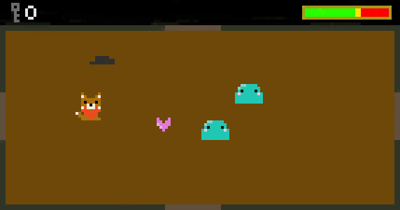

- Both player and monsters move with a certain speed and acceleration, making it challenging to aim. 

- Certain paths may be blocked by obstacles. 

    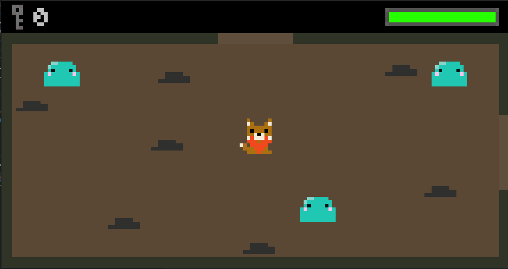

- Player's current health is displayed in the HUD.

    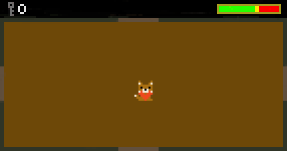

- The enemies can attack by touching the player.
- Upon death, the number of keys will increase, used to open doors and access new areas in the map.

    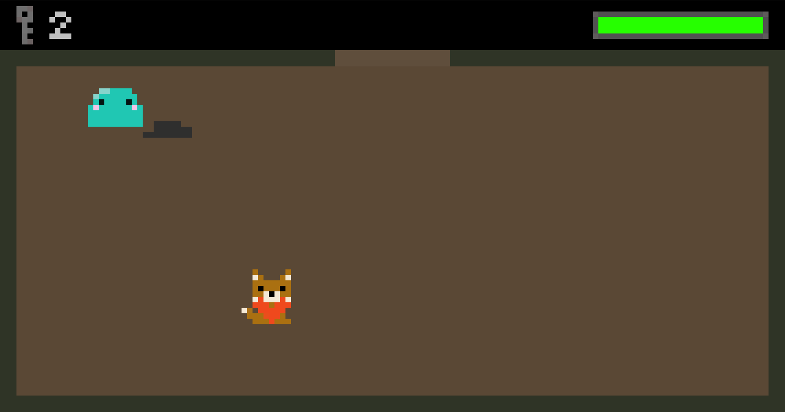

- You can use a menu at the end and start of your gameplay

    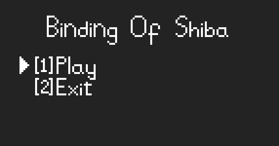

### DESIGN

#### General Structure

- **Problem in Context**. We needed a way to organize our code that would allow us to easily add new features and to easily test what we've added. Since this is also a GUI application, the MVC (Model-View-Controller) came to mind.

- **The Pattern**. The *Model-View-Controller pattern* is an **Architectural pattern** in which the code is split up into three parts: the model, the controller and the view. The model is responsible for storing the data, the controller is responsible for mutating the model and the view is responsible for rendering the model.

- **Implementation**. As we've said before, the MVC pattern has three major components: the model (for storing data), the controller (for mutating the model and controlling the logic of the game) and the view (for rendering the game to the screen).

    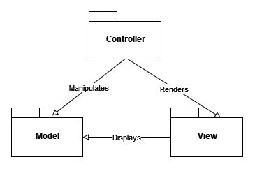

    <strong>Fig 1.</strong> MVC Pattern

- **Consequences**. The use of this pattern allows for easier introduction of new features and enforces the Single Responsibility Principle. On the down side, this pattern creates a class for each model, which leads to a lot of dumb classes (classes that can't do anything on their own).

 

#### Interactions with Lanterna

- **Problem in Context**. Lanterna is an external dependency in which breaking changes can be introduced at any time. To take care of this, we need a way to isolate calls to Lanterna. Furthermore, we only need to access a very small part of Lanterna's API for our game. The *Facade pattern* immediately came to mind. This pattern allows us to choose what functionalities to expose and, if a breaking change gets introduced in Lanterna, we only need to update the methods in the facade instead of having to perform [shotgun surgery](https://refactoring.guru/smells/shotgun-surgery).

- **The Pattern**. The pattern is made up of an interface, which specifies the functionalities to implement, and an implementation of those functionalities, using another class' methods (in this case, Lanterna's Screen and InputProvider). By using the Facade design pattern, we ensure our code changes are minimal, in case an external method is updated. Furthermore, we can choose what functionalities to expose and considering Lanterna has hundreds of methods to use, this came as a natural choice.

- **Implementation**. We use the Facade pattern in two places: the GUI interface and the Keyboard interface. Their concrete implementations are LanternaGUI and LanternaKeyboard, respectively. LanternaGUI handles graphic operations such as clearing the draw buffer or refreshing it and LanternaKeyboard is responsible for keeping track of the key the user is pressing.

    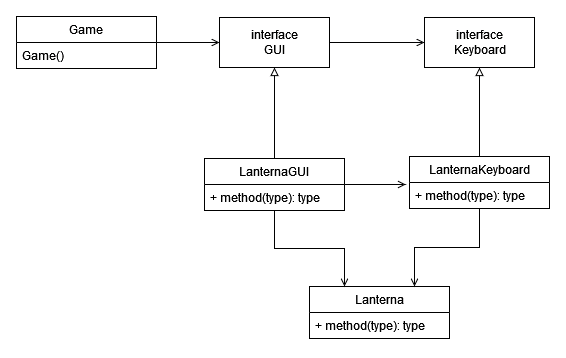

    <strong>Fig 2.</strong> Facade pattern

- **Consequences**. The use of the Facade design pattern allows for easier maintenance, and a lower amount of duplicated code. It also provides less cluttered code, where we only use the methods we need from Lanterna. On a final note, it opens the possibility that other GUI and Keyboard providers could be implemented and used with minimal changes to our code.

 

#### Application state

- **Problem in Context**. We need a way to know when the application is on the menu or when it is running the game. We could use if statements with a boolean variable, but it would make the code more dificult to update (if we wanted to add, for instance, a shop, we would have to add another if statement and change the boolean variable to an int). As such, the *State pattern* came to mind. It uses polymorphism to solve this problem, meaning each state (menu, game, ...) has its own class with its own logic. Because of this, the organization of the application becomes visible in the code and much more organized.

- **The Pattern**. The State pattern consists of a context (that contains the state) and a few states. Each state has access to the context and, as such, can change its state to another state.

- **Implementation**. In our Main class, we have our application state, which will be either a menu state or a game state (currently, it can only be a game state). When the user starts the game on the menu, the state of the application changes and the game starts. When the game ends, the state changes again and the window closes.

    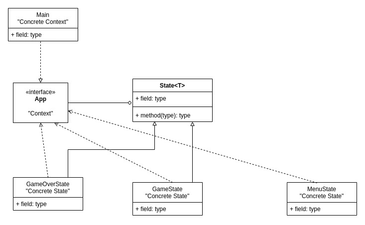

    <strong>Fig 3.</strong> State pattern

- **Consequences**. The State pattern allows us to use polymorphism to replace code that otherwise would have had a lot of if statements. Because of that, it makes the code clearer and makes the overall structure of the application easily visible.

 

#### Texture Builders

- **Problem in Context**. To implement our game's designs, such as the Shiba, all the enemies and the health bar, we needed an effective method to print the draw art on to the screen. The same happened for text. To solve this, we implemented the Builder pattern, to both render text and images.

- **The Pattern**. The Builder pattern comes of use when an object can have multiple configurations and is made up of a bunch of other objects, while hiding all the building process from the main client.

- **Implementation**. With this pattern, we created full rendered images by reading all the pixels and colors from the original image and locating them according to the image's rotation. They are created and stored in a Bundle of textures, for later use. For text, the builder will transform text into drawable elements, using a chosen, 4x5 pixel font.

    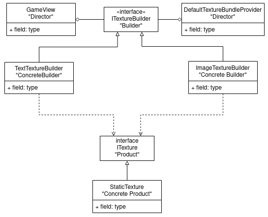

    <strong>Fig 4.</strong> Builder pattern

- **Consequences**. This pattern will allow us to have more control over the building methods, as they are separated from the caller function, and we don't need to change/possibly corrupt as much code as we would if we did not implement this. It also makes code more readable for other developers.

 

#### Event Manager

- **Problem in Context**. When an element collides with another, they both should be notified of this occurrence, hence the Observer pattern coming to mind.  

- **The Pattern**. The Observer pattern allows us to notify the interested parties of important events, such as, in our case, collisions and attacks. The notified classes will then know what to do upon receiving an update.

- **Implementation**. Our receiver (subscriber) classes will be the controllers of monsters, projectiles and our main character, Shiba. Upon hitting or being hit by another element, they will be notified and do the correspondent action, depending on what it collided with. Some views also subscribe to certain events, in order to know when to create/destroy other views.

    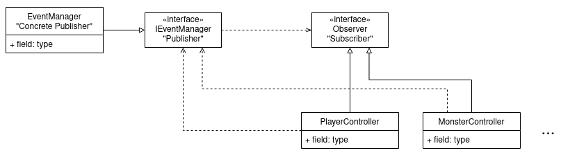

    <strong>Fig 5.</strong> Observer pattern

- **Consequences**. This pattern will allow the objects in our program to act more independently in different situations. It will also be easier to change the actions we want them to have, as the code is less scattered around. With this pattern, for instance, we can keep all the code related to the player's behaviour on its controller, no matter how complex some interactions may get.

 

#### KNOWN CODE SMELLS AND REFACTORING SUGGESTIONS

#### Speculative Generality

We have an event class that is not used. The `PlayerDamagedByMonsterEvent` was supposed to be a way for us to do graphical updates upon player damage. We chose an easier route, for the time we had.

### TESTING

- Screenshot of coverage report.

    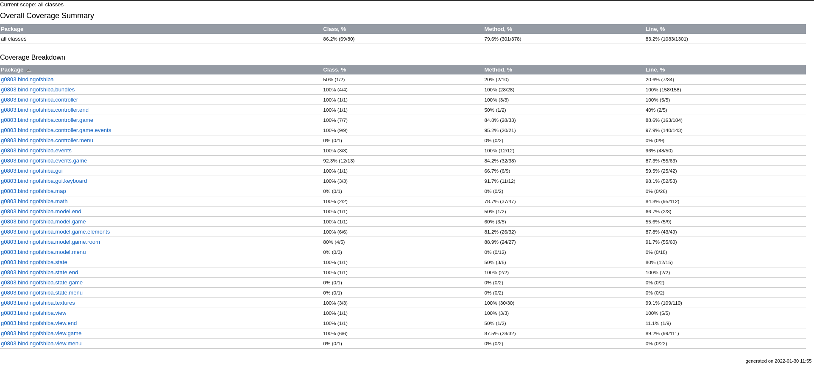

### SELF-EVALUATION

We have all given our best and feel like the work was equally distributed across all participants.

- [André Lima](https://github.com/limwa): 33.3%
- [Guilherme Almeida](https://github.com/gui1612): 33.3%
- [Mariana Lobão](https://github.com/marineve17): 33.3%
